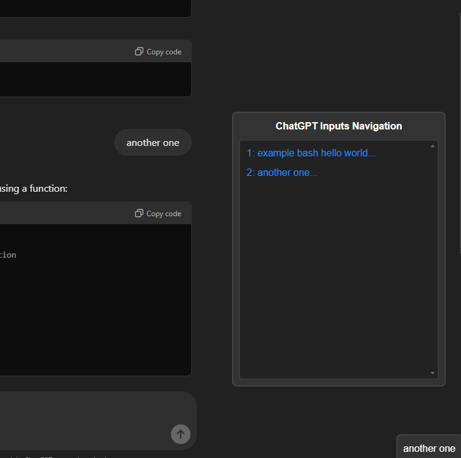

- Enhances ChatGPT by adding a draggable navigation panel that displays user inputs.
- Hovering over an entry shows a modal with the full message text.
- Clicking an entry scrolls to the corresponding message, while Shift+Clicking pins (toggle) the modal, keeping it open until unpinned.
- The panel updates dynamically to reflect new inputs.

## Example

